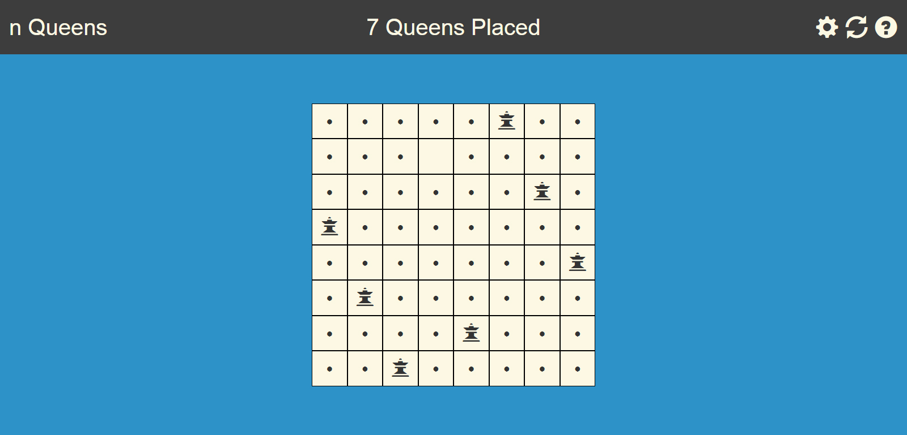
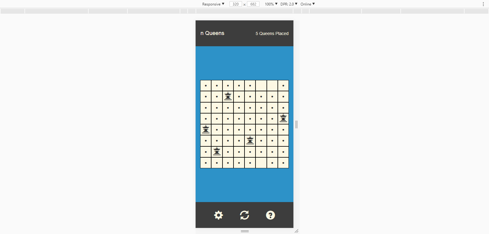

Name: Joseph Morris
Date: 07/10/2016

[Click here for live demo!](http://themanysidesof.me/demo/nQueens/ "Click here for live demo!")

# Note:
This code has not been edited or maintained since it was written. It serves as an example of my ongoing explorations in coding.

# Description:
This is a mobile-friendly version of the eight queens puzzle (or n Queens problem type). It tracks the user's achievements by recording the number of solutions found as well as how long it took to solve. The user can also change the grid to 9x9, 10x10, 11x11, and 12x12.
